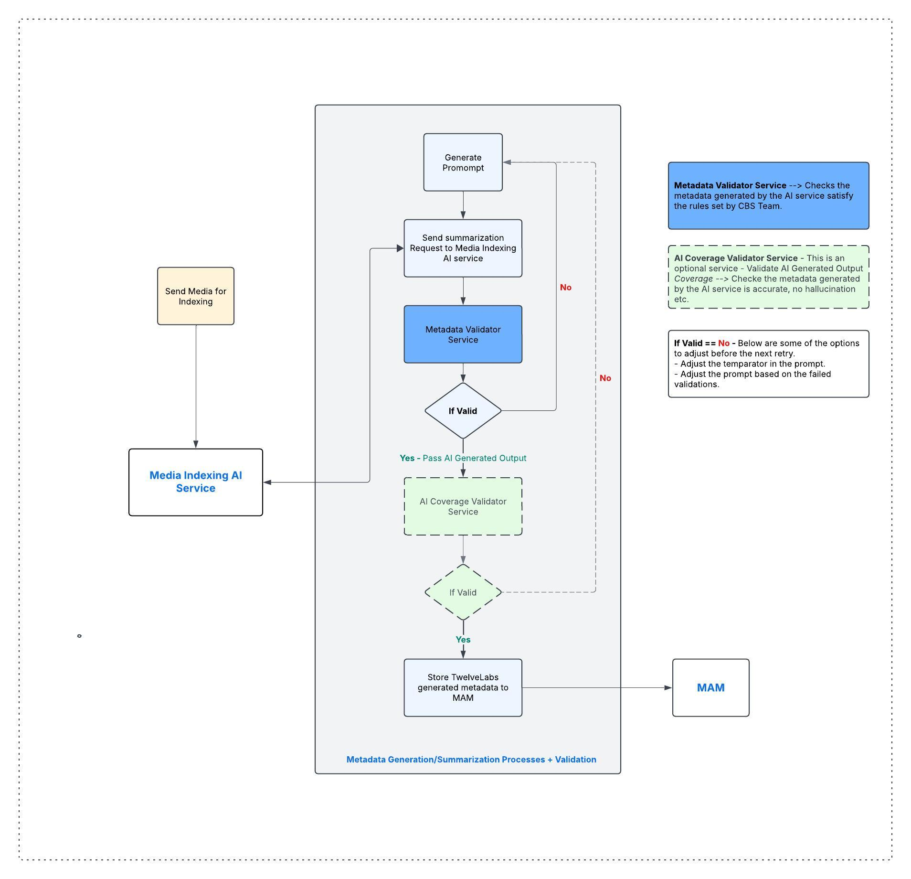

# AI Media Indexing Validation: A Guide to Metadata Quality Control

## Table of Contents
- [Background](#background)
- [Why a Quality Check Required](#why-a-quality-check-required)
- [Prompt to AI Media Service](#prompt-to-ai-media-service)
- [Overview - Validation Services](#overview---validation-services)
- [Metadata Validator Service](#metadata-validator-service)
  - [Validation Rules](#validation-rules)
  - [Sample Rules](#sample-rules)
  - [Validation Application](#validation-application)
- [AI Coverage Validator Service](#ai-coverage-validator-service)
- [When Validation Fails](#when-validation-fails)

## Background

Enterprises, media companies, and modern content creators all face the challenge of understanding their extensive petabytes of archived data. Currently, several AI services are available in the market that can index media files using techniques such as transcription, optical character recognition, and computer vision, etc.

These Media Indexing services also provide GenAI models which enable generating metadata, summarizing videos, semantic search, and more. ome notable media indexing AI services include Twelve Labs, Coactive, and various others.

Adopting these media indexing technologies presents unique challenges due to the non-deterministic nature of AI. Organizations implementing these technologies must undergo thorough testing phases to build confidence in the media indexing services they choose. This process is crucial for ensuring that they trust the system before deploying it in a production environment.

In this document, I aim to break down these challenges and explain how different types of validation services can be integrated into enterprises’ media orchestration pipelines to ensure that AI-generated metadata meets their established standards.

## Why a Quality Check Required

AI-generated metadata has transformed media indexing and content summarization, but this technology presents inherent challenges that require effective quality validation.
The non-deterministic nature of AI is one of the critical reasons why quality checks are necessary. Unlike traditional rule-based systems, AI models can produce varying results even with the same input due to:

- Decision-making processes in machine learning often involve probabilities.  
- Confidence levels can vary across different content types.  
- There are limitations in contextual understanding that may cause inconsistent outputs.

Without proper validation mechanisms, organizations risk inconsistent metadata quality that could undermine the value of their media indexing initiatives and erode stakeholder confidence in AI-powered solutions.

## Prompt to AI Media Service

In this documentation, we focus on the video summary prompt for the AI service to summarize the metadata of videos that have already been indexed (embedded data created).

The prompt can generate metadata or provide a transcription, among other options.

Below is a sample prompt for generating a video summary, which I am referring to in the context of the metadata validation services.

```
Provide natural-language summary for the first 25 minutes of the video. Give complete summary of the video and
If the video contains multiple distinct tech segments e.g., product reviews, tutorials, tech news, hardware demonstrations, software walkthroughs, interviews with tech experts, divide the summary into labeled sections per segment. Group related tech topics into a segment.

For each segment, include the following details only if the information is explicitly present or visual/audio confirmed.
1. Segment Title
2. Description
Give a technical description focusing on specifications, features, and functionality in maximum 200 characters
3. Timestamps
Give approximate start and end times for the segment(e.g.,00:00–02:15).
4. Editorial subjects: The specific tech matters or issues focused on in the video. Include all relevant topics.
5. Visual Subjects
Summarize the main visual elements, such as:
- Tech devices/hardware
- User interfaces/software
- Demonstrations/benchmarks
- Technical diagrams/charts
- Development environments/code
- Tech experts/presenters
6. Names: All identifiable persons mentioned or shown (tech reviewers, developers, company representatives, etc.)

Do not hallucinate or assume missing details. Omit any field that is not supported.
Ensure you look at minute by minute details for each segment, summarize them even if its longer and do no miss any minute. This is important, look at each minute and summarize them.
Give the output in JSON format and include confidence(low, medium or high) and score(in the range of 1 to 100) level for each fields in a segment.
```

## Overview - Validation Services

The Video Summary Metadata Validator is a tool designed to validate the quality and structure of video summaries generated by AI services like TwelveLabs or Coactive or other AI services. It ensures that video summaries meet predefined quality standards by checking against a set of validation rules defined in a YAML configuration file.

- A validator service will help enforce consistency in the AI service's generated output.
- This service will also help prevent errors like missing required information in the generated metadata.
- The validation service will help us bring consistency to the summarization processes and consistency to the metadata stored in the MAM.

There are various approaches to validating the metadata generated by AI services that utilize video indexing data sources(embeded data). I will discuss two specific approaches:

- Metadata Validator Service
- AI Coverage Validator Service

These two services work together to ensure that the metadata generated by the AI service is accurate and covers the relevant facts in the media. By combining these services, the process can determine whether the generated metadata meets the defined standards. If it does not, the system can initiate a regeneration of the metadata from the GenAI model.



## Metadata Validator Service

- Validate the generated metadata and decide whether metadata meets the standards we established.
- Validates the structure and content of AI-generated video summaries and metadata.
- Configurable validation rules via YAML files.

### Validation Rules

The validation rules are defined in a YAML file and specify requirements for various aspects of video summaries.

#### Rule Structure

The validation rules follow a hierarchical structure:

```yaml
validation:
  structure:
    fields:
      segments:
        item_schema:
          fields:
            field_name:
              required: true/false
              type: string/array/number/object
              other_constraints...
```

### Sample Rules

```yaml
validation:
  structure:
    required: true
    type: object
    fields:
      segments:
        required: true
        type: array
        min_items: 5
        item_schema:
          type: object
          fields:
            segment_title:
              required: true
              type: string
              min_length: 10
              confidence:
                required: true
                type: string
                enum: ["low", "medium", "high"]
                threshold: "high"
              score:
                required: true
                type: number
                min: 1
                max: 100
                threshold: 90
            editorial_subjects:
              required: true
              type: array
              min_items: 2
              confidence:
                required: true
                type: string
                enum: ["low", "medium", "high"]
                threshold: "high"
              score:
                required: true
                type: number
                min: 1
                max: 100
                threshold: 90
```

### Validation Application

For testing the design, I have developed a Python application that validates the output of GenAI's video summarization, which is provided in JSON format. The application reads the JSON file and checks it against the YAML rules defined in the aforementioned rules file, producing a detailed validation report that highlights any issues.

This design allows for easy adjustments to quality standards by simply modifying the YAML file, making it adaptable to various content types.

Here's a [sample validation summary](./examples/validation_summary.json) from the application:

```json
{
  "valid": false,
  "segments_validation": [
    {
      "segment_index": 0,
      "segment_title": "Comparison and Switching Reasons",
      "valid": true,
      "field_validations": {
        "segment_title": {
          "valid": true,
          "json_field_name": "Segment Title",
          "errors": []
        },
        "timestamps": {
          "valid": true,
          "json_field_name": "Timestamps",
          "errors": []
        },
        "editorial_subjects": {
          "valid": true,
          "json_field_name": "Editorial subjects",
          "errors": []
        },
        "visual_subjects": {
          "valid": true,
          "json_field_name": "Visual Subjects",
          "errors": []
        },
        "names": {
          "valid": true,
          "json_field_name": "Names",
          "errors": []
        },
        "location": {
          "valid": true,
          "json_field_name": null,
          "errors": []
        }
      }
    },
    {
      "segment_index": 1, .....
      ......
  ],
  "summary": {
    "total_segments": 3,
    "valid_segments": 2,
    "invalid_segments": 1,
    "overall_status": "FAIL"
  }
}
```

## AI Coverage Validator Service

The AI Coverage Validator Service consolidates the output generated by the GenAI service. For instance, in the metadata summary use case, it extracts metadata fields like "segment_title" or "visual_subject," and then generates a prompt to request the GenAI service to evaluate the generated summary output.

We can either use the same GenAI service or a different AI service to validate the output produced.
- In the case of Twelve Labs, we might use the Pegasas model for validation.
- If we are leveraging AWS Bedrock to index media and create embedding data, we can utilize a GenAI model as long as the GenAI model has access to the embeddings created from the original video.

## When Validation Fails

The process should retry the request (video summarization in this example) to GenAI in order to generate the metadata. This corresponds to the "if valid == No" case in the above diagram. There are several options to consider during the retry:

- Adjust the prompt based on the specific rules that failed validation.
- Modify the GenAI configurations such as temperature, topK, or topP, depending on the available options in the GenAI model.
- Decide on the number of retries, 'n', in the loop.
- We must determine whether we are satisfied with 'n' retries or if we should re-add the summarization process back into the queue for later processing.
